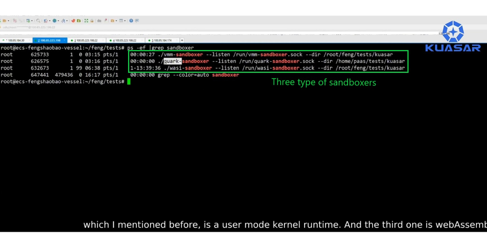

---
authors:
- Kuasar Admin
categories:
- General
- Announcements
date: 2023-04-18
draft: false
lastmod: 2023-04-18
summary: Various sandboxes running in a single node
tags:
- Kuasar
- Sandbox
- demo vedio
- wasmedge
- quark
- cloud-hypervisor
- node
title: How to Use Kuasar to Start Different Sandboxes
---

# Various sandboxes running in a single node

## Video

Kuasar provides the ability to run various sandboxes in just a single node. You will find that a resident process replaces all the shim processes.

This is the demo video (on Youtube), hope you like it! 

## Screenshots

Here are some screenshots of the demo video.

